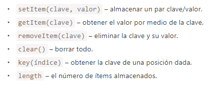

https://lenguajejs.com/javascript/objetos/json/


# Objetos

https://lenguajejs.com/javascript/objetos/que-son/

## Recursos extra

https://es.javascript.info/object

https://es.javascript.info/object-methods

(No forma parte del ámbito de este curso) https://es.javascript.info/prototype-inheritance


# Clases

En JavaScript moderno hay un constructor más avanzado, “class”, que introduce características nuevas muy útiles para la programación orientada a objetos.

https://es.javascript.info/class

## Ejemplo de código equivalentes

```
class alumno {
    constructor(id, nombre, imagen, notas) {
        this.id = id,
        this.nombre = nombre,
        this.imagen = imagen,
        this.notas = notas
    }
}

// Creo 4 alumnos de prueba
// El array de notas va en orden según la tabla html
const alumno1 = new alumno(1, "Tyson Fury", "imgs/avatar1.jpg", [10, 8, 5, 9, 7, 9]);
const alumno2 = new alumno(2, "Katie Taylor", "imgs/avatar2.jpg", [1, 5, 6, 9, 10, 3]);
const alumno3 = new alumno(3, "Carolina Marín", "imgs/avatar3.jpg", [5, 7, 5, 3, 7, 10]);
const alumno4 = new alumno(4, "Sandra Sánchez", "imgs/avatar4.jpg", [7, 8, 5, 2, 7, 9]);

// Base de Datos
const baseDeDatos = [alumno1, alumno2, alumno3, alumno4];
```

```
const baseDeDatos =[
    {
        id: 1,
        nombre: 'Tyson Fury',
        imagen: 'imgs/avatar1.jpg',
        notas: [10, 8, 5, 9, 7, 9]
    },
    {
        id: 2,
        nombre: 'Katie Taylor',
        imagen: 'imgs/avatar2.jpg',
        notas: [1, 5, 6, 9, 10, 3]
    },
    {
        id: 3,
        nombre: 'Carolina Marín',
        imagen: 'imgs/avatar3.jpg',
        notas: [5, 7, 5, 3, 7, 10]
    },    
    {
        id: 4,
        nombre: 'Sandra Sánchez',
        imagen: 'imgs/avatar4.jpg',
        notas: [7, 8, 5, 2, 7, 9]
    }    
];

```

# Almacenando datos en el navegador

1. Cookies, document.cookie
2. LocalStorage, sessionStorage
3. IndexedDB

https://es.javascript.info/data-storage

## LocalStorage

Solo vamos a trabajar con **LocalStorage**

Las principales funcionalidades de localStorage son:

- Es compartido entre todas las pestañas y ventanas del mismo origen.
- Los datos no expiran. 
- Persisten a los reinicios de navegador y hasta del sistema operativo.





## SessionStorage

El objeto **sessionStorage** se utiliza mucho menos que localStorage.

Las propiedades y métodos son los mismos, pero es mucho más limitado ya que sessionStorage solo existe dentro de la pestaña actual del navegador. Otra pestaña con la misma página tendrá un almacenaje distinto.

https://es.javascript.info/localstorage


